# Navigation Flow Diagram

This document visualizes the complete navigation flow of the Claude Agent Prompts Integration Tool.

## Main Menu Navigation Flow

## Breadcrumb Trail Examples

## Category Structure

```mermaid
flowchart TD
    Categories[9 Main Categories]

    Categories --> Core[💻 Core Development<br/>5 Agents]
    Categories --> GitHub[🐙 GitHub Integration<br/>13 Agents]
    Categories --> Hive[👑 Hive-Mind<br/>5 Agents]
    Categories --> Swarm[🐝 Swarm Coordination<br/>3 Agents]
    Categories --> SPARC[⚡ SPARC Methodology<br/>4 Agents]
    Categories --> Optimization[🚀 Optimization<br/>5 Agents]
    Categories --> Testing[✅ Testing<br/>2 Agents]
    Categories --> DevOps[⚙️ DevOps<br/>1 Agent]
    Categories --> Analysis[🔍 Analysis<br/>2 Agents]

    Core --> C1[coder]
    Core --> C2[planner]
    Core --> C3[researcher]
    Core --> C4[reviewer]
    Core --> C5[tester]

    GitHub --> G1[pr-manager]
    GitHub --> G2[code-review-swarm]
    GitHub --> G3[issue-tracker]
    GitHub --> G4[And 10 more...]

    style Categories fill:#FF6B35,stroke:#C44D2C,color:#fff
    style Core fill:#4ECDC4,stroke:#3BA99C,color:#fff
    style GitHub fill:#95E1D3,stroke:#6FB8A9,color:#000
    style Hive fill:#F38181,stroke:#D55555,color:#fff
```

## User Journey Scenarios

### Scenario 1: Browse and Select Specific Agents

```mermaid
sequenceDiagram
    participant U as User
    participant M as Main Menu
    participant B as Browse
    participant C as Category View
    participant A as Agent View

    U->>M: Launch integrate.js
    M->>U: Display 7 options
    U->>M: Select "Browse Categories"
    M->>B: Navigate to Browse
    B->>U: Show 9 categories
    U->>B: Select "Core Development"
    B->>C: Load category
    C->>U: Show 5 agents
    U->>C: Select "coder"
    C->>A: Display agent details
    A->>U: Show metadata + preview
    U->>A: Toggle selection (✓)
    A->>U: Agent selected
    U->>A: Back to category
    A->>C: Return
    U->>C: Select "tester"
    C->>A: Display agent details
    U->>A: Toggle selection (✓)
    U->>A: Main Menu
    A->>M: Return to main
    U->>M: Select "Integrate"
    M->>U: Success!
```

### Scenario 2: Quick Preset Integration

### Scenario 3: Search and Integrate

## State Diagram

## Selection State Flow

## Key Navigation Shortcuts

| From State | Shortcut | Action |
|------------|----------|--------|
| Any View | `Ctrl+C` | Exit program |
| Category/Results | `↑/↓` | Navigate list |
| Agent View | `Space/Enter` | Toggle selection |
| Agent View | `b` | Back to previous |
| Agent View | `m` | Main menu |
| Any Menu | `q` | Quit/Back |
| Search Results | `n` | New search |

## Navigation Tips

1. **Breadcrumbs**: Always visible at top showing current location
2. **Selection Counter**: Shows "X agents selected" in header
3. **Visual Indicators**:
   - `✓` = Selected agent
   - `○` = Unselected agent
   - `→` = Current menu item
4. **Loading States**: Spinner animation during operations
5. **Color Coding**: Each category has unique color
6. **Progress Tracking**: Real-time feedback during integration

---

**Tool Version:** 1.1.0
**Total Menu Options:** 7
**Total Navigation Paths:** 20+
**Max Depth:** 4 levels (Home → Browse → Category → Agent)
