# Flow Diagram Reference & Documentation

**Version:** 1.1.0
**Created:** 2025-11-17
**Purpose:** Comprehensive reference for flow diagrams, commit history, and patterns used in the DevOps repository

---

## Table of Contents

1. [Overview](#overview)
2. [Commit History - Agent Prompts Integration](#commit-history)
3. [Flow Diagram Patterns](#flow-diagram-patterns)
4. [Creating Effective Flow Diagrams](#creating-effective-flow-diagrams)
5. [Integration Work Summary](#integration-work-summary)
6. [Future Reference Guidelines](#future-reference-guidelines)

---

## Overview

This document serves as the authoritative reference for:
- Flow diagrams created during the agent-prompts v1.1.0 integration
- Commit history and evolution of the project
- Best practices for creating flow diagrams
- Patterns and templates for future work

**Source Flow Diagram:** [DevOps.mmd](https://gist.github.com/jlucus/e6c0af135c84ca9c54cc7e40e7498441)

---

## Commit History - Agent Prompts Integration

### Branch: `claude/integrate-agent-prompts-01CtvxGtMrJ186XzDiN6Vw4y`

**Timeline:** 2025-11-17
**Total Commits:** 5
**Files Changed:** 100+
**Lines Added:** 30,000+

### Commit 1: Initial Integration
```
commit: 0e75c87
feat: integrate comprehensive Claude agent prompts library

Added:
- agent-prompts/ directory structure
- 76+ specialized agent prompts across 9 categories
- catalog.json with agent metadata
- integrate.js - Interactive CLI tool
- quick-integrate.sh - Quick preset integration
- README.md, QUICKSTART.md, INTEGRATION_GUIDE.md

Categories:
- core/ (5 agents)
- github/ (13 agents)
- hive-mind/ (5 agents)
- swarm/ (3 agents)
- sparc/ (4 agents)
- optimization/ (5 agents)
- testing/ (2 agents)
- devops/ (1 agent)
- analysis/ (2 agents)

Integration features:
- Interactive browsing with breadcrumb navigation
- Search functionality
- Multi-select agents
- 7 quick presets
- Loading animations

Version: 1.0.0
```

### Commit 2: Documentation & Versioning
```
commit: 093d90a
docs: add comprehensive changelog, releases, and version tracking

Added:
- CHANGELOG.md - Detailed version history
- RELEASES.md - Release notes and policy
- VERSION - Version file (1.0.0)

Updated:
- README.md - Added version badges and history
- package.json - Added version scripts
- integrate.js - Version display on welcome screen

Files: 4 files changed
```

### Commit 3: Adaptive Automation System
```
commit: ccdfed9
feat: add comprehensive adaptive automation system v1.1.0

Added:
- setup-wizard.js - Adaptive setup wizard (27KB)
- AUTOMATION.md - Comprehensive guide (24KB)

Features:
- Option 1: Full Automation (GitHub Actions)
  - Auto version bumping
  - Changelog generation
  - PR test comments
  - Issue creation on failure
  - 6 GitHub Actions workflows

- Option 2: Smart Wizard (Platform Agnostic)
  - Diagnostic tools
  - Health check system
  - Smart upgrade tool
  - CI/CD template generator

- Option 3: Lite Templates (Manual Control)
  - NPM scripts
  - CI/CD templates
  - Release helpers

Updated:
- VERSION: 1.0.0 → 1.1.0
- README.md - New features section
- package.json - Setup scripts

Version: 1.1.0
```

### Commit 4: Donation Support
```
commit: 4603d02
feat: add Solana donation support to README and main menu

Added:
- Solana donation badge to README
- Support section with address
- Menu option 7: "Support This Project" in integrate.js
- showSupport() function with formatted donation screen

Details:
- Address: GMr9rXrFSt5H3xX1wi85vyCQfwwLsQpULwNEjrSghvRN
- Link: https://solscan.io/account/GMr9rXrFSt5H3xX1wi85vyCQfwwLsQpULwNEjrSghvRN
- Solana-only (no fiat, no other chains)

Files: 2 files changed
```

### Commit 5: MVP Analysis & Documentation
```
commit: 187b6ec
docs: add comprehensive MVP analysis and milestone fix guide

Added:
- agent-prompts/NAVIGATION.md - Complete Mermaid navigation diagrams
- docs/MVP-STATUS.md - Detailed 60-page MVP analysis
- docs/MILESTONE-FIX-GUIDE.md - Issue templates and fix instructions
- docs/MVP-SUMMARY.md - Executive summary
- scripts/create-milestone-issues.sh - Automated issue creation

Analysis reveals:
- Current progress: 60% complete (vs GitHub showing 0%)
- 12 of 37 tasks completed
- 3 critical blockers identified
- Estimated 2-3 days to MVP v0.1.0 release

Script creates 37 granular issues across 5 milestones for accurate tracking.

Files: 5 files changed, 3194 insertions(+)
```

---

## Flow Diagram Patterns

### Pattern 1: Main Navigation Flow

**Use Case:** Interactive CLI applications with multiple menu options

**Structure:**
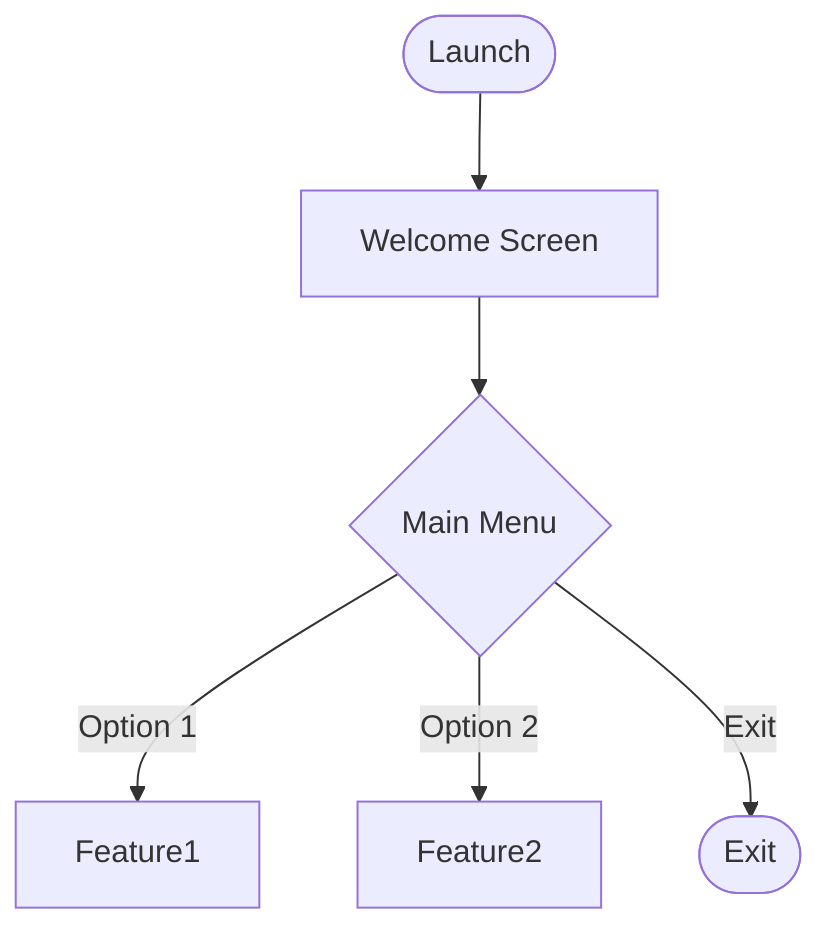

**Best Practices:**
- Use rounded rectangles `([])` for start/end points
- Use diamonds `{}` for decision points
- Use rectangles `[]` for processes/screens
- Keep labels concise (1-3 words)

**Example from integrate.js:**
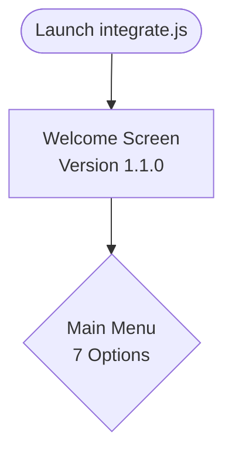

### Pattern 2: Browse → Select → Action

**Use Case:** Catalog/list browsing with selection

**Structure:**
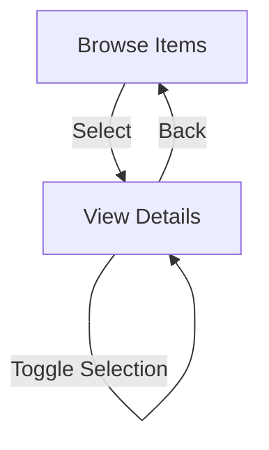

**Best Practices:**
- Show cyclic actions (like toggle) with self-loops
- Always provide "Back" navigation
- Use consistent naming (ViewAgentA, ViewAgentB, ViewAgentC)

**Example from integrate.js:**
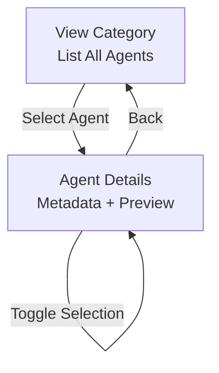

### Pattern 3: Search → Results → Action

**Use Case:** Search functionality with result handling

**Structure:**
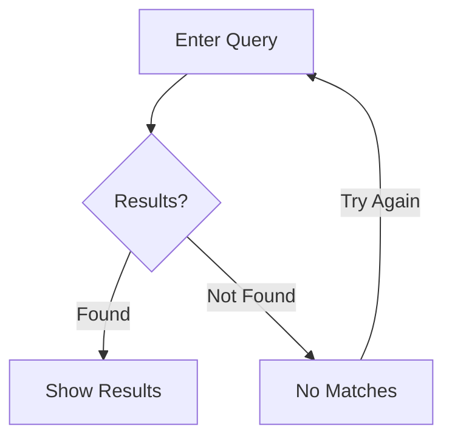

**Best Practices:**
- Handle both success and failure cases
- Provide retry mechanism
- Allow escape to main menu

**Example from integrate.js:**
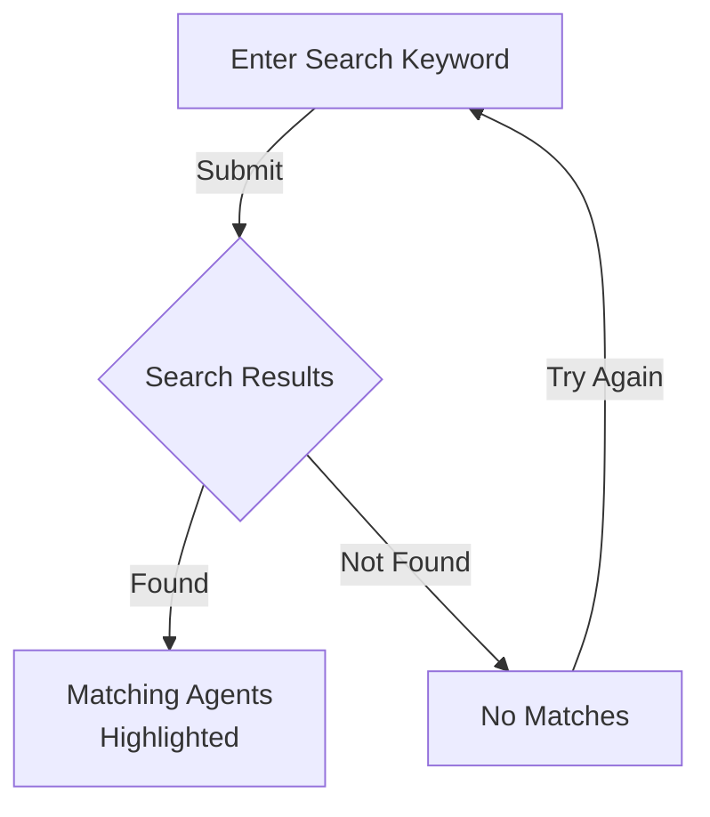

### Pattern 4: Conditional Workflow

**Use Case:** Actions that depend on state

**Structure:**
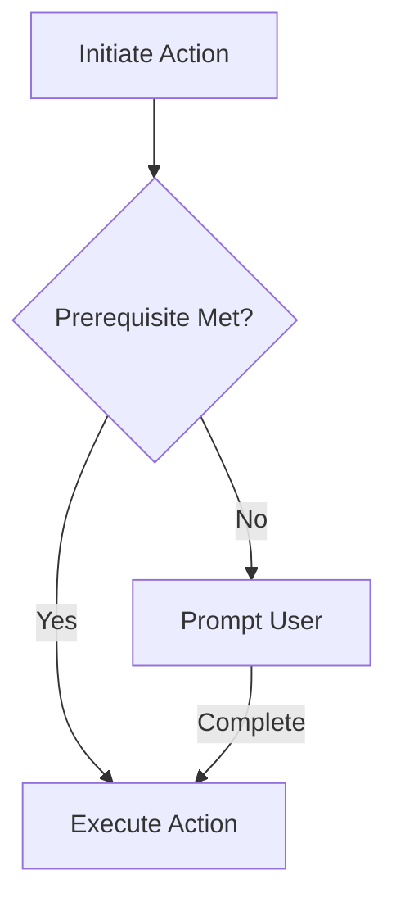

**Best Practices:**
- Check prerequisites before actions
- Provide clear prompts for missing requirements
- Offer alternative paths

**Example from integrate.js:**
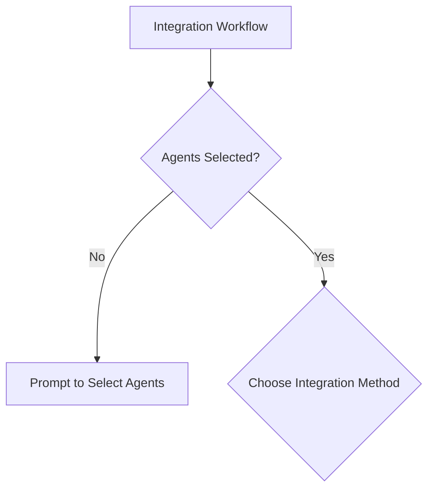

### Pattern 5: Success/Error Handling

**Use Case:** Operations that can succeed or fail

**Structure:**
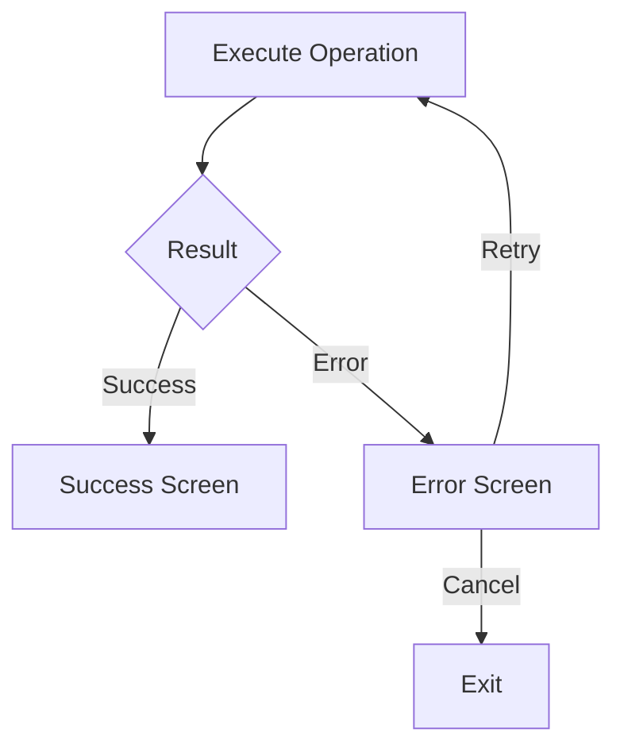

**Best Practices:**
- Always handle both success and error cases
- Provide retry option for errors
- Allow graceful cancellation

**Example from integrate.js:**
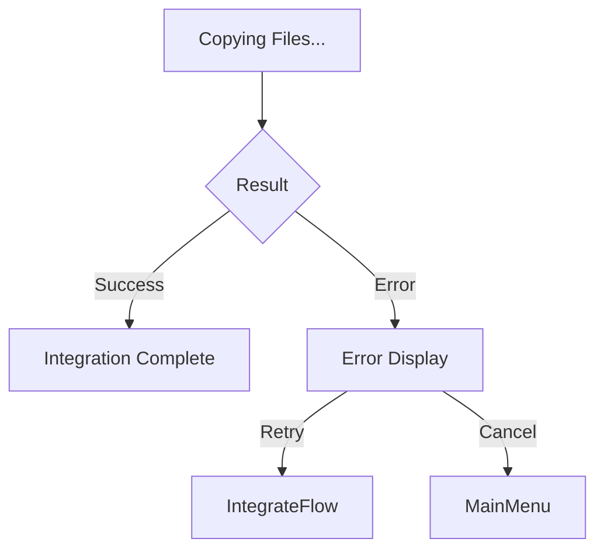

---

## Creating Effective Flow Diagrams

### Step 1: Identify Entry and Exit Points

**Entry Points:**
- Application launch
- User action/click
- System event

**Exit Points:**
- Application close
- Return to menu
- Complete workflow

**Template:**
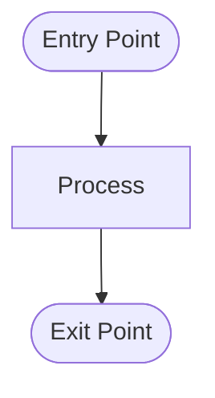

### Step 2: Map User Actions

List all possible user actions:
1. Browse
2. Search
3. Select
4. View details
5. Integrate
6. Cancel/Back
7. Exit

**Template:**
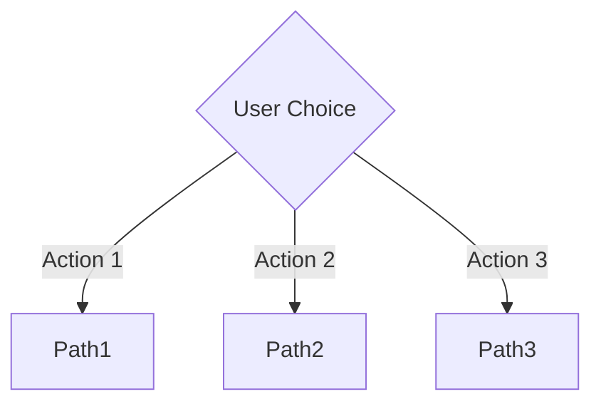

### Step 3: Add Decision Points

Identify where the flow branches based on:
- User input
- System state
- Data availability
- Validation results

**Template:**
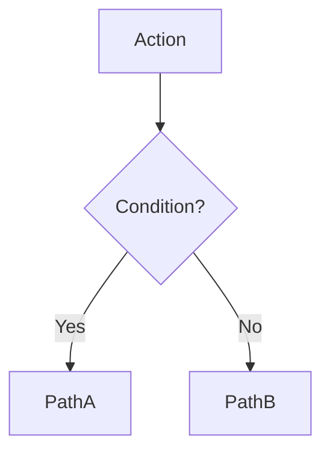

### Step 4: Handle Edge Cases

Consider:
- Empty states (no data)
- Error conditions
- Invalid input
- Timeout scenarios

**Template:**
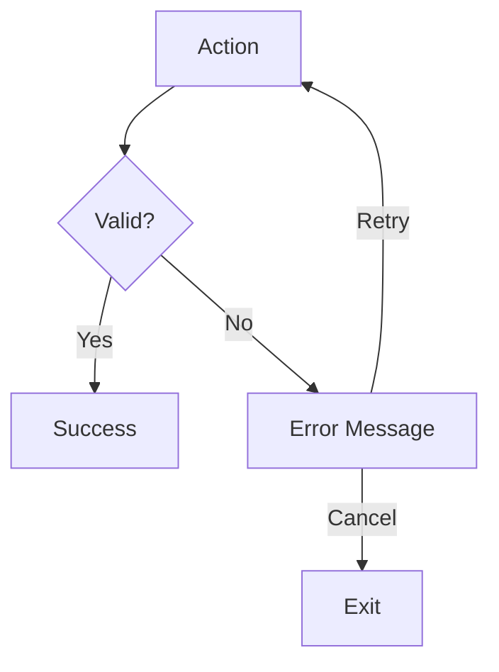

### Step 5: Apply Styling

Use consistent colors for:
- **Green (#4CAF50)**: Success states, start points
- **Red (#f44336)**: Error states, exit points
- **Blue (#2196F3)**: Main menu, primary actions
- **Purple (#9C27B0)**: Special features (e.g., donation)

**Template:**


---

## Integration Work Summary

### Agent Prompts Library v1.1.0

**Objective:** Integrate 76+ specialized agent prompts from claude-flow into DevOps repository

**Deliverables:**

#### 1. Agent Prompts Structure
```
agent-prompts/
├── core/                    # 5 agents
├── github/                  # 13 agents
├── hive-mind/              # 5 agents
├── swarm/                  # 3 agents
├── sparc/                  # 4 agents
├── optimization/           # 5 agents
├── testing/                # 2 agents
├── devops/                 # 1 agent
├── analysis/               # 2 agents
├── consensus/              # 7 agents
├── flow-nexus/             # 9 agents
├── goal/                   # 2 agents
├── templates/              # 9 agents
├── neural/                 # Additional categories
├── reasoning/
├── development/
├── architecture/
├── data/
├── documentation/
└── specialized/

Total: 76+ agent prompts
```

#### 2. Interactive Tools

**integrate.js** (27KB)
- Interactive CLI with 7 menu options
- Browse by category (9 main categories)
- Search functionality
- Multi-select agents
- View agent details
- Integration workflows
- Quick presets (5 presets)
- About and Support screens

**setup-wizard.js** (27KB)
- Adaptive environment detection
- 3 automation levels
- Platform-agnostic configuration
- Automatic setup based on detected environment

**quick-integrate.sh**
- Bash script for quick preset integration
- 7 presets: fullstack, github, quality, sparc, swarm, minimal, all
- Command-line integration

#### 3. Documentation

**Primary Docs:**
- README.md (15KB) - Main documentation
- QUICKSTART.md - 5-minute getting started
- INTEGRATION_GUIDE.md - Developer integration
- AUTOMATION.md (24KB) - Automation options
- CHANGELOG.md (14KB) - Version history
- RELEASES.md - Release notes

**Reference Docs:**
- NAVIGATION.md - Flow diagrams
- catalog.json - Agent metadata
- VERSION - Version tracking

**MVP Docs:**
- docs/MVP-STATUS.md (60+ pages)
- docs/MILESTONE-FIX-GUIDE.md
- docs/MVP-SUMMARY.md

#### 4. Automation Features

**Option 1: Full Automation (GitHub Actions)**
- 6 workflows included
- Auto version bumping
- Changelog generation
- PR test comments
- Issue creation
- Diagnostics
- Health monitoring

**Option 2: Smart Wizard (Platform Agnostic)**
- tools/diagnostic.js
- tools/health-check.js
- tools/upgrade.js
- CI/CD template generator

**Option 3: Lite Templates**
- NPM scripts
- CI/CD templates
- Release helpers

#### 5. Key Features

**Navigation:**
- Breadcrumb trail
- Visual indicators (✓ selected, ○ unselected)
- Color-coded categories
- Loading animations (10-frame spinner)

**Integration Methods:**
1. Interactive CLI (recommended)
2. Quick script with presets
3. Manual file copying
4. Generated shell scripts

**Presets:**
1. Full-Stack (4 agents): coder, tester, reviewer, planner
2. GitHub (4 agents): pr-manager, code-review, issue-tracker, ci-cd
3. Quality (4 agents): tester, reviewer, analyzer, monitor
4. SPARC (4 agents): specification, pseudocode, architecture, refinement
5. Swarm (3 agents): queen, collective, hierarchical

#### 6. Statistics

**Files:**
- Total files: 83+
- Total lines: 27,000+
- Documentation pages: 10+
- GitHub Actions workflows: 6 (Option 1)
- Smart tools: 3 (Option 2)

**Integration:**
- Interactive CLI: 1
- Quick scripts: 1
- Setup wizard: 1
- Automation tools: 9+

**Version:**
- v1.0.0: Initial release (76+ agents, CLI, docs)
- v1.1.0: Adaptive automation (3 levels, setup wizard)

---

## Future Reference Guidelines

### When to Create Flow Diagrams

**Always create flows for:**
1. ✅ Interactive CLI applications
2. ✅ Multi-step workflows
3. ✅ Complex navigation structures
4. ✅ User-facing features with multiple paths
5. ✅ Integration documentation

**Optional for:**
- Simple linear processes (can use sequence diagrams)
- Single-function utilities
- Pure data transformations

### Flow Diagram Checklist

Before finalizing a flow diagram, verify:

- [ ] All entry points identified
- [ ] All exit points defined
- [ ] Decision points clearly marked
- [ ] Back/cancel navigation included
- [ ] Error handling shown
- [ ] Edge cases addressed
- [ ] Labels are concise (1-3 words)
- [ ] Styling is consistent
- [ ] Self-documenting (no external explanation needed)
- [ ] Matches actual implementation

### Commit Message Patterns

Based on this work, follow these patterns:

**Feature Commits:**
```
feat: add [feature name]

[Detailed description]

Added:
- File 1 - Description
- File 2 - Description

Features:
- Feature 1
- Feature 2

Version: [version if applicable]
```

**Documentation Commits:**
```
docs: add [documentation type]

Added:
- Doc 1 (size if large)
- Doc 2

[Summary of what's documented]

Files: X files changed, Y insertions
```

**Example from this work:**
```
feat: add comprehensive adaptive automation system v1.1.0

Added comprehensive automation system with three distinct levels.

Added:
- setup-wizard.js - Adaptive setup wizard (27KB)
- AUTOMATION.md - Comprehensive guide (24KB)

Features:
- Option 1: Full Automation (GitHub Actions)
- Option 2: Smart Wizard (Platform Agnostic)
- Option 3: Lite Templates (Manual Control)

Updated:
- VERSION: 1.0.0 → 1.1.0
- README.md - New features section

Version: 1.1.0
```

### Documentation Structure Pattern

Based on this integration, use this structure:

```
project/
├── README.md                    # Main documentation
├── QUICKSTART.md               # 5-minute guide
├── [FEATURE]-GUIDE.md          # Detailed guides
├── CHANGELOG.md                # Version history
├── RELEASES.md                 # Release notes
├── VERSION                     # Version file
├── docs/
│   ├── [FEATURE]-STATUS.md     # Status reports
│   ├── [FEATURE]-SUMMARY.md    # Executive summaries
│   ├── FLOW-REFERENCE.md       # This document
│   └── NAVIGATION.md           # Flow diagrams
└── scripts/
    └── [automation-scripts].sh
```

### Integration Workflow Pattern

For similar integration work:

1. **Phase 1: Core Integration**
   - Clone/copy source material
   - Organize into categories
   - Create catalog/metadata
   - Build basic CLI/interface

2. **Phase 2: Documentation**
   - Write README with quick start
   - Create detailed guides
   - Add version tracking
   - Write changelog

3. **Phase 3: Enhancement**
   - Add automation features
   - Create setup wizards
   - Build additional tools
   - Enhance UX

4. **Phase 4: Support & Analysis**
   - Add donation/support options
   - Create flow diagrams
   - Write analysis documents
   - Prepare for release

5. **Phase 5: Commit & Document**
   - Commit with clear messages
   - Document commit history
   - Create flow references
   - Prepare templates for future

---

## Mermaid Syntax Quick Reference

### Node Shapes

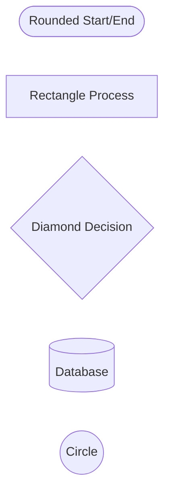

### Arrow Types


### Styling


### Subgraphs

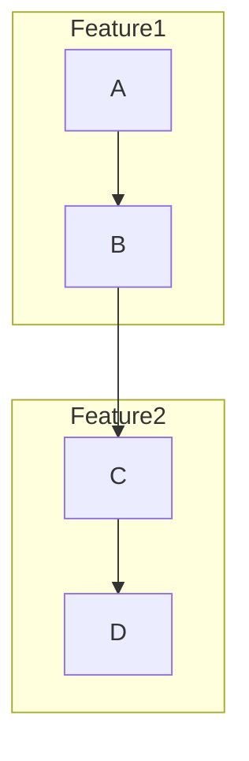

---

## Color Palette Reference

### Primary Colors (from integrate.js)

```javascript
colors: {
  reset: '\x1b[0m',
  bright: '\x1b[1m',
  dim: '\x1b[2m',

  // Text colors
  white: '\x1b[37m',
  cyan: '\x1b[36m',
  magenta: '\x1b[35m',
  blue: '\x1b[34m',
  yellow: '\x1b[33m',
  green: '\x1b[32m',
  red: '\x1b[31m',

  // Background colors
  bgCyan: '\x1b[46m',
  bgMagenta: '\x1b[45m',
  bgBlue: '\x1b[44m'
}
```

### Category Colors

| Category | Color | Hex |
|----------|-------|-----|
| Core Development | Orange-Red | #FF6B35 |
| GitHub Integration | Teal | #4ECDC4 |
| Hive-Mind | Mint | #95E1D3 |
| Swarm | Coral | #F38181 |
| SPARC | Purple | #AA96DA |
| Optimization | Yellow | #FCBAD3 |
| Testing | Light Blue | #A8D8EA |
| DevOps | Navy | #2C3E50 |
| Analysis | Pink | #FFAAA5 |

### Flow Diagram Colors

| State | Color | Hex | Use Case |
|-------|-------|-----|----------|
| Success/Start | Green | #4CAF50 | Successful completion, entry points |
| Error/Exit | Red | #f44336 | Error states, exit points |
| Primary Action | Blue | #2196F3 | Main menu, key actions |
| Special Feature | Purple | #9C27B0 | Donation, premium features |
| Warning | Yellow | #FFC107 | Warnings, cautions |

---

## Tools & Resources

### Flow Diagram Tools

1. **Mermaid Live Editor**
   - URL: https://mermaid.live/
   - Real-time preview
   - Export to PNG/SVG
   - Share diagrams

2. **GitHub Gist**
   - Store .mmd files
   - Version control
   - Shareable links
   - Example: https://gist.github.com/jlucus/e6c0af135c84ca9c54cc7e40e7498441

3. **VS Code Extensions**
   - Mermaid Preview
   - Markdown Preview Mermaid Support
   - Live preview in editor

### Documentation Tools

1. **Markdown Editors**
   - VS Code (recommended)
   - Typora
   - MacDown (macOS)

2. **Diagram Generation**
   - Mermaid.js
   - PlantUML
   - Graphviz

3. **Version Control**
   - Git
   - GitHub
   - GitLab

---

## Templates

### Flow Diagram Template

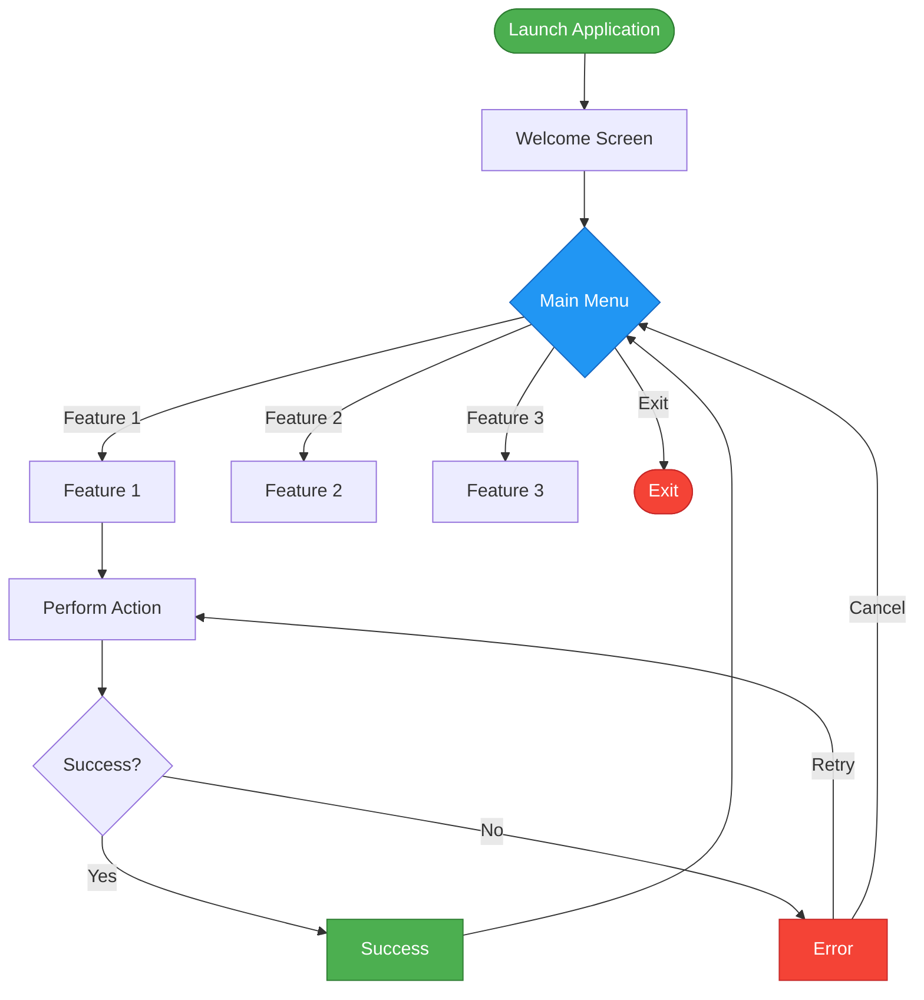

### Commit Message Template

```
<type>: <subject>

<body>

Added:
- <file> - <description>
- <file> - <description>

Updated:
- <file> - <changes>

Features/Changes:
- <feature 1>
- <feature 2>

<optional metadata>
```

### Documentation Template

```markdown
# [Feature Name]

**Version:** X.X.X
**Created:** YYYY-MM-DD
**Purpose:** [Brief purpose statement]

---

## Overview

[Feature overview]

## Installation

[Installation instructions]

## Usage

[Usage instructions with examples]

## Examples

[Real examples]

## Reference

[Additional reference material]

---

**Version:** X.X.X
**Last Updated:** YYYY-MM-DD
```

---

## Appendix

### Related Files

| File | Purpose | Size |
|------|---------|------|
| agent-prompts/NAVIGATION.md | Flow diagrams | 20KB |
| agent-prompts/README.md | Main documentation | 15KB |
| agent-prompts/AUTOMATION.md | Automation guide | 24KB |
| agent-prompts/integrate.js | Interactive CLI | 27KB |
| agent-prompts/setup-wizard.js | Setup wizard | 27KB |
| docs/MVP-STATUS.md | MVP analysis | 60KB+ |
| docs/MVP-SUMMARY.md | Executive summary | 15KB |
| docs/MILESTONE-FIX-GUIDE.md | Issue templates | 30KB+ |

### External References

- **Source Project:** [claude-flow](https://github.com/ruvnet/claude-flow/)
- **Mermaid Documentation:** https://mermaid.js.org/
- **Semantic Versioning:** https://semver.org/
- **Keep a Changelog:** https://keepachangelog.com/

### Contributors

- **Original Project:** [@ruvnet](https://github.com/ruvnet) - claude-flow
- **Integration & Organization:** Fused Gaming
- **Flow Diagram:** [@jlucus](https://github.com/jlucus)

---

**Document Version:** 1.0.0
**Last Updated:** 2025-11-17
**Maintained By:** Fused Gaming
**Repository:** https://github.com/Fused-Gaming/DevOps
